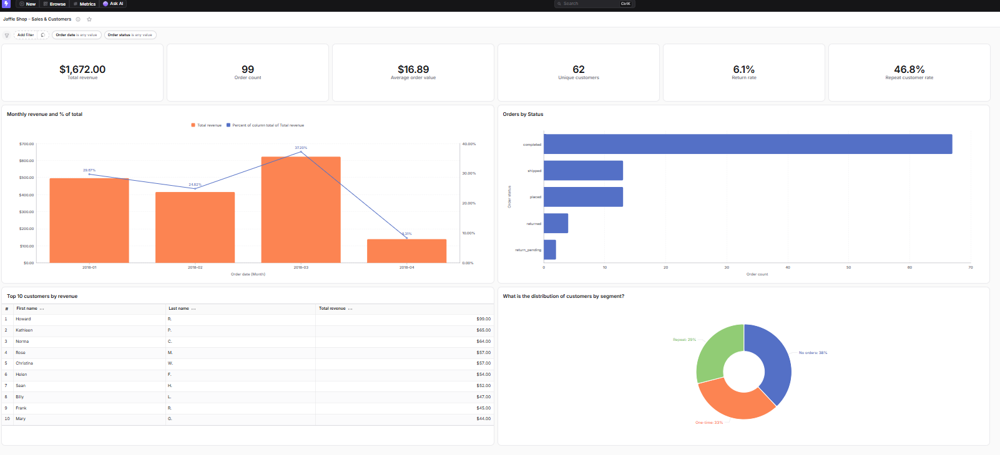

# Jaffle Shop — dbt + Lightdash

An end-to-end analytics project built on the dbt Fundamentals course dataset and taken further:
a tested, documented dbt project on BigQuery with a **Lightdash semantic layer** (metrics, custom
dimensions and joins) and a sales & customers dashboard on top of it.

| Layer | Tool |
|---|---|
| Transformation | dbt (developed in dbt Cloud; Cloud CLI for local runs) |
| Warehouse | Google BigQuery (`jaffleshop-510513`, dev dataset `dbt_nmusacco`) |
| Semantic layer & BI | Lightdash (connected to this repo's `main` branch via GitHub) |
| Version control | GitHub — feature branch → pull request → merge to `main` |

How AI was used while building it is documented in [AI_DEVLOG.md](AI_DEVLOG.md).

## Lineage

```
dbt-tutorial.jaffle_shop.customers ─► stg_jaffle_shop__customers ───────────────────┐
dbt-tutorial.jaffle_shop.orders    ─► stg_jaffle_shop__orders ────┬──────────────────┤
dbt-tutorial.stripe.payment        ─► stg_stripe__payments ───────┴─► fct_orders ─────┴─► dim_customers
```

## Models

| Layer | Model | Materialization | Grain | Notes |
|---|---|---|---|---|
| staging | `stg_jaffle_shop__customers` | view | one row per customer | renames `id` → `customer_id` |
| staging | `stg_jaffle_shop__orders` | view | one row per order | renames keys, `status` → `order_status` |
| staging | `stg_stripe__payments` | view | one row per payment attempt | converts `amount` from cents to dollars |
| marts / finance | `fct_orders` | table | one row per order | amount = sum of **successful** payments |
| marts / marketing | `dim_customers` | table | one row per customer | order history + `lifetime_value` |

Staging models are views (cheap, always fresh); marts are tables (fast for BI queries). This is set
per folder in `dbt_project.yml`.

## Semantic layer (Lightdash)

Metrics and custom dimensions live next to the models, under `config: meta:` in
[`_finance.yml`](models/marts/finance/_finance.yml) and [`_marketing.yml`](models/marts/marketing/_marketing.yml)
(dbt ≥ 1.10 syntax). dbt builds the tables; Lightdash reads the YAML and generates the aggregation
SQL at query time, so marts keep a fine grain and users can slice metrics by any dimension.

| Metric | Model | Definition |
|---|---|---|
| `total_revenue` | fct_orders | Sum of successful payments, USD. |
| `order_count` | fct_orders | Count of distinct orders, any status. |
| `average_order_value` | fct_orders | Average paid amount per order, USD. |
| `completed_orders` | fct_orders | Distinct orders with status `completed`. |
| `return_rate` | fct_orders | (`returned` + `return_pending` orders) / all orders. |
| `unique_customers` | fct_orders | Distinct customers with at least one order. |
| `customer_count` | dim_customers | Distinct customers, including those with no orders. |
| `average_lifetime_value` | dim_customers | Average lifetime value per customer, USD. |
| `repeat_customer_rate` | dim_customers | Customers with 2+ orders / customers with 1+ orders. |

- **Custom dimension** `customer_segment` on `dim_customers`: `No orders` / `One-time` / `Repeat`,
  derived from `number_of_orders` with SQL in the YAML.
- **Join** `fct_orders` → `dim_customers` (many-to-one), so order metrics can be split by customer
  name or segment — the Lightdash equivalent of a Looker explore with a join.

Reference values (dev data): revenue **$1,672**, **99** orders, AOV **$16.89**, **100** customers
(62 with orders), return rate **6.1%**, repeat customer rate **46.8%**. Repeat customers are 47% of
buyers but generate ~70% of revenue.

## Dashboard

**Jaffle Shop – Sales & Customers** (Lightdash)

- KPIs: Total revenue, Order count, Average order value, Unique customers, Return rate, Repeat customer rate
- Revenue by month
- Orders by status
- Customers by segment
- Top 10 customers by revenue (uses the `fct_orders` → `dim_customers` join)
- Dashboard filters: order date, order status



## Testing

32 data tests run on every `dbt build`, which tests sources first and then builds and tests each
model in DAG order (a failing test skips everything downstream of it).

- **Sources**: primary keys `unique` + `not_null`; foreign keys `relationships`; `accepted_values` on
  payment status; freshness config on `jaffle_shop` (`_etl_loaded_at`).
- **Staging**: primary keys, foreign keys, `accepted_values` for order status and payment method.
- **Marts**: primary keys on `fct_orders` / `dim_customers`, `relationships` from fact to dimension.
- **Singular test**: [`assert_stg_stripe__payments_total_positive`](tests/assert_stg_stripe__payments_total_positive.sql)
  fails if any order has a negative total payment.

Accepted values were chosen after profiling the actual data, not assumed.

## How to run

With the dbt Cloud CLI (uses the dbt Cloud dev credentials, no warehouse keys stored locally):

```bash
dbt build                          # everything: sources tests, models, model tests
dbt build --select +dim_customers  # a model and all its parents
dbt test --select source:*         # only source tests
dbt source freshness
```

## Adapting this project to Redshift

The project is warehouse-agnostic by design (sources and `ref()` instead of hard-coded table names),
but moving it to Amazon Redshift would need these changes:

1. **Adapter and connection** — install/use `dbt-redshift` and point the dbt Cloud environment (or
   `profiles.yml`) to the cluster or Redshift Serverless workgroup: `host`, `port 5439`, `dbname`,
   `schema`, IAM or user/password auth. Each developer still gets their own dev schema.
2. **Sources** — in `_src_*.yml`, `database:` becomes the Redshift database and `schema:` the schema
   where the raw data lands (e.g. `raw.jaffle_shop`, `raw.stripe`). No model SQL changes, because
   models only use `source()` and `ref()`.
3. **Integer division** — `amount/100` in `stg_stripe__payments` returns a decimal in BigQuery but an
   **integer** in Redshift (`1250/100 = 12`). It must become `amount / 100.0` or
   `cast(amount as decimal(10,2)) / 100`. This is the kind of silent bug the `not_null`/revenue
   checks would not catch, so it would deserve a test on a known total.
4. **Physical design for marts** — Redshift has no automatic clustering like BigQuery, so tables
   should declare distribution and sort keys, e.g. for `fct_orders`:
   `{{ config(materialized='table', dist='customer_id', sort='order_date') }}`
   (distribute on the join key to `dim_customers`; sort on the most filtered column).
   Small dimensions like `dim_customers` can use `dist='all'`.
5. **Late-binding views** — staging views can use `bind=False` so that dropping/recreating the
   underlying raw tables does not break them.
6. **Incremental models** — as data grows, `fct_orders` would become `materialized='incremental'`
   with `incremental_strategy='delete+insert'` (or `merge`) on `order_id`, filtering on
   `order_date`/a loaded-at timestamp.
7. **Lightdash** — change the warehouse connection to Redshift (host, port, database, user, SSL);
   the semantic layer YAML stays the same. Custom SQL in metrics (`CASE`, `COUNT(DISTINCT)`,
   `NULLIF`) is ANSI and works on both warehouses.
8. **Cost model** — BigQuery charges per bytes scanned; Redshift per node-hour (provisioned) or
   RPU-second (Serverless). On Redshift the levers are dist/sort keys, `ANALYZE`/`VACUUM` (mostly
   automatic now) and workload management, rather than partitioning and bytes billed.
